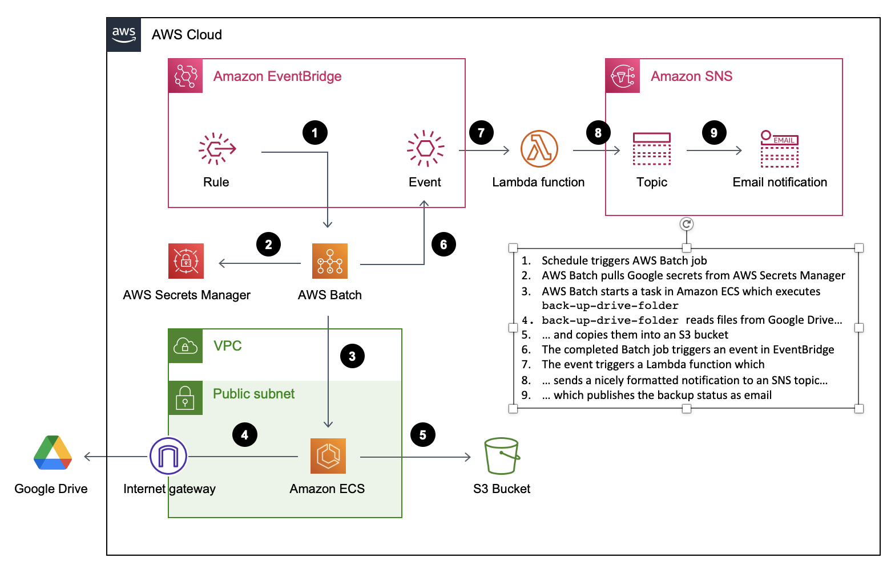

# G2S3


G2S3 is a solution to regularly back up your Google data by copying it over to S3.

**This is work in progress.**

What's working:
- It can copy a single Google Drive folder with all files in it (non-recursively) to S3
- CDK deploys AWS Batch jobs, necessary compute environment, queues, SNS topics, subscriptions, etc.

What's not working yet:
- Recursive copy of a Google Drive folder, or entire Google Drive into S3.

There's also an accompanying blog post:
- [**Backing Up Google Photos to Amazon S3**](
  https://medium.com/better-programming/backing-up-google-photos-to-amazon-s3-221e42a32a95)
  published in [Better Programming](https://betterprogramming.pub/)

## "Quick" Start Guide

1. In [Google Cloud Platform (GCP)](https://console.cloud.google.com/):
   1. create a new project (e.g. "g2s3")
   2. enable the [Google Drive API](https://console.cloud.google.com/apis/api/drive.googleapis.com)
   3. [create a OAuth 2.0 consent screen](https://console.cloud.google.com/apis/credentials/consent).
   4. Download credentials (TODO: add how)
2. Build and run the `retrieve-google-tokens` binary (TODO: add instructions)
3. In [your AWS account](https://console.aws.amazon.com/)
   1. "Store a new secret" in
      [AWS Secrets Manager](https://eu-west-1.console.aws.amazon.com/secretsmanager/listsecrets)
   ("Other type of secret")
   3. Add `CLIENT_ID`, `CLIENT_SECRET`, and `REFRESH_TOKEN` into new secret as key/value pairs
4. Choose **one** of the following two options:
   - Option 1: Using a personal fork and your own Docker image:
      1. On GitHub, [fork this repository](https://github.com/petergtz/g2s3/fork), enable
      GitHub Actions in your forked repository, and wait for the Action to successfully complete.
      2. In your terminal, run:

             git clone git@github.com:<GITHUB_USER>/g2s3.git
             cd g2s3

   - Option 2: Using `petergtz` repo and the associated Docker image:
        1. In your terminal, run:

               git clone https://github.com/petergtz/g2s3.git
               cd g2s3

5. To configure your backup setup:
   1. In your terminal, run:

          cp cdk/bin/deployment-config.json.example cdk/bin/deployment-config.json

   2. Fill in proper values in `cdk/bin/deployment-config.json` (hopefully self-explanatory)
6. Assuming `aws` CLI is installed and configured correctly, run:

       ./scripts/cdk-deploy.sh

## Architecture Diagram



## Components

G2S3 consists of three main components:
- a **binary** built with Rust to copy files from Google Drive to S3, called `back-up-drive-folder`
- a **Docker image** built from a Dockerfile to package `back-up-drive-folder`, available as GitHub
[Package g2s3/g2s3](https://github.com/petergtz/g2s3/pkgs/container/g2s3%2Fg2s3).
- a **CDK stack** to deploy everything as AWS Batch job to regularly invoke `back-up-drive-folder`

### CLI `back-up-drive-folder`

This CLI can be invoked locally for testing, or from the cloud when part of a regular backup.
For instructions, on how to use it:

```shell
$ back-up-drive-folder --help
```

### Docker Image


The [Docker image](https://github.com/petergtz/g2s3/pkgs/container/g2s3%2Fg2s3) (built via
[this GitHub Action](
https://github.com/petergtz/g2s3/blob/main/.github/workflows/build-and-package-rust-binary.yaml))
can be used directly using:

```shell
$ docker pull ghcr.io/petergtz/g2s3/g2s3:latest
```

Or it can be built using:

```shell
$ ./scripts/build-release.sh && ./scripts/build-container.sh
```

### CDK Stack

The CDK stack can be found in `./cdk/lib`.

<delete-me>
